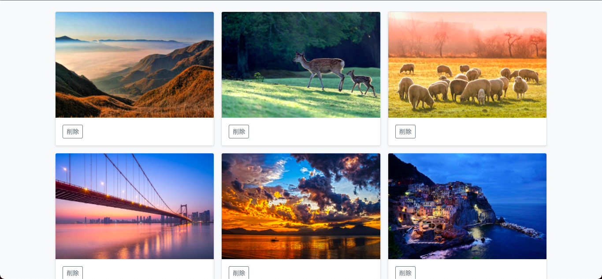
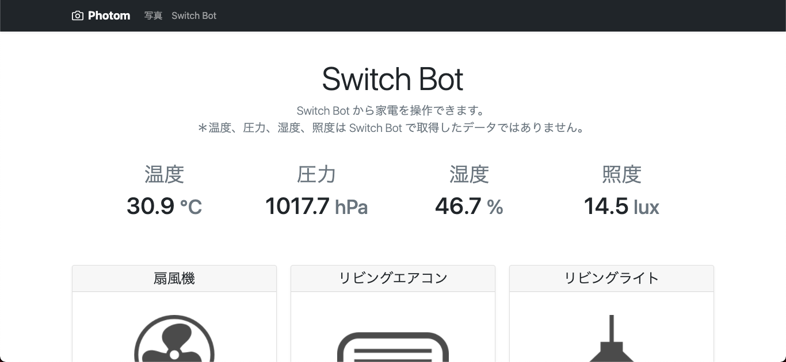
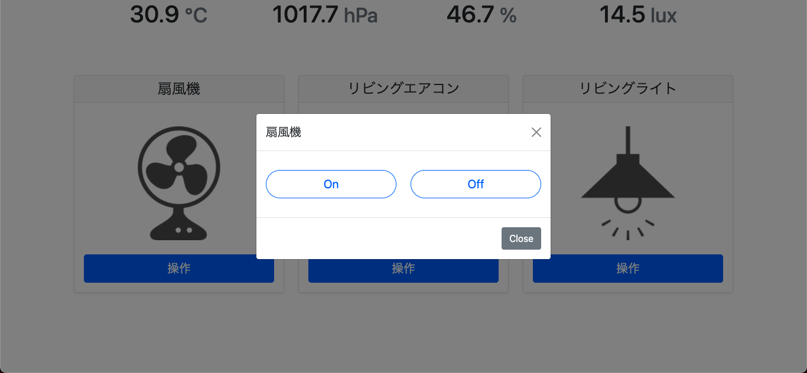
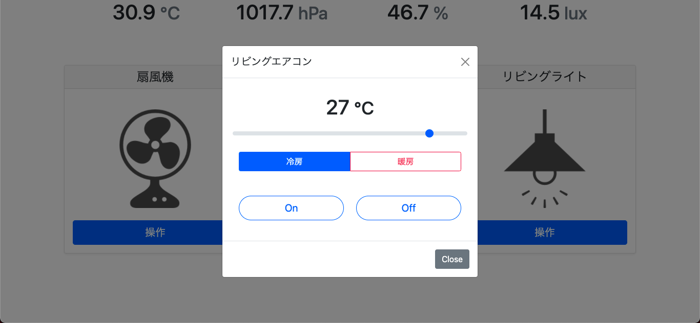

# Photom-Web
画像管理と家電操作を目的とした簡易ローカル Web アプリケーション。

## 開発環境
### ハード
- RaspberryPi Zero WH
- [RPZ-IR-Sensor Rev.2.0](https://www.indoorcorgielec.com/products/rpz-ir-sensor/)

### OS
- Raspberry Pi OS Lite
  - Release date: May 7th 2021
  - Kernel version: 5.10

### ソフト
- Docker
- Python 3.7.3（Docker image）

### ライブラリ

| 名前 | 用途 |
|:----|:----|
| docopt | RPZ-IR-Sensor 依存 |
| flask | Webアプリフレームワーク |
| flask-marshmallow | ORM |
| flask_sqlalchemy | ORM |
| marshmallow | ORM |
| marshmallow-sqlalchemy | ORM |
| smbus | RPZ-IR-Sensor 依存 |
| Pillow | 画像処理 |
| requests | 通信 |

requirements.txt 参照

## 初期設定
#### 外部の API （OpenWeather と Switch bot）を使用するための設定
1. プロジェクト直下に private_config.py というファイルを作成
2. 以下の内容を追加し、値をそれぞれ設定

```python
OPEN_WEATHER_API_KEY = 'ここに OpenWeather API Key を入力'
SWITCH_BOT_TOKEN = 'ここに Switch bot Token を入力'
SECRET_KEY = '任意文字列'
```

#### RaspberryPi に Docker と docker-compose をインストール
```
# curl https://get.docker.com | sh
# apt install docker-compose
```

＊ Docker を使用するにあたり、メモリ不足になる可能性があるためスワップを増やしておくのを推奨。以下コマンドでファイルを開き、`CONF_SWAPSIZE` の部分を任意のサイズに変更する
```
sudo vim /etc/dphys-swapfile
```

#### RaspberryPi の IP アドレスを固定する（無線）
```
sudo vim /etc/dhcpcd.conf
```
上記コマンドでファイルを開き、以下のように追記する。
```
interface wlan0
static ip_address=192.168.11.60/24
static routers=192.168.11.1
static domain_name_servers=192.168.11.1
```
IPアドレスはルータ側で割り当てられるIPの数と割り当てられているIPを確認した上で設定する。ゲートウェイなどは以下コマンドで確認する。
```
route -n
```

#### RaspberryPi のローカルホスト名変更（任意）
デフォルトのローカルホスト名が raspberrypi.local になっているので raspberrypi-zero.local に変更する。以下2つのファイルの raspberrypi の部分を raspberrypi-zero に変更する
```
sudo vim /etc/hostname
sudo vim /etc/hosts
```

#### RaspberryPi の I2C を有効化
RPZ-IR-Sensor を使用するため、以下コマンドから設定を開き、I2Cを有効化しておく
```
# sudo raspi-config
```

## 起動方法
```
# cd photom-web
# docker-compose up
```

## 注意事項
main ブランチでは RaspberryPi ではなく、PC 上での動作を目的としています。RaspberryPi での動作は raspberrypi_zero ブランチで確認できます。アプリ上で RPZ-IR-Sensor から各種センサーの値を表示している箇所がありますが、main ブランチの方ではモックで起動します。

## スクリーンショット





